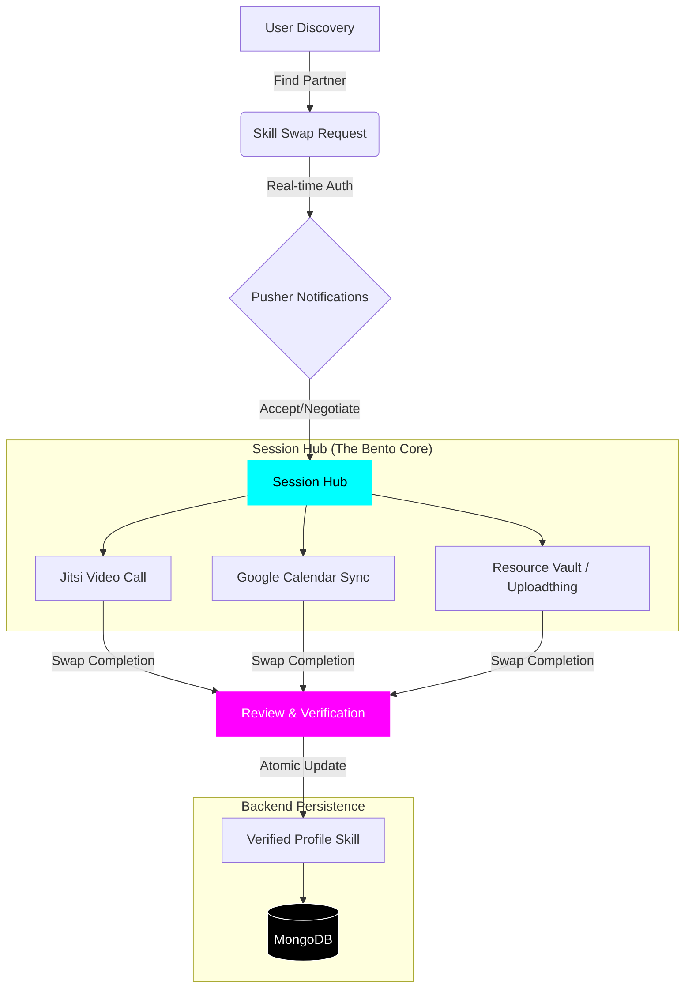

# 💎 KODA | Peer-to-Peer Skill Exchange

<div align="center">
  
  <h3>Mastery through Exchange</h3>
  <p><i>A premium, automated ecosystem for community-driven skill swapping.</i></p>
  
  []()
  []()
  []()
  []()
</div>

---

## 🌌 The Vision
**Koda** is not just a platform; it's a movement towards decentralized learning. Built for developers, creatives, and lifelong learners, Koda facilitates the exchange of expertise without the barrier of cost. Whether you're a Python expert looking to learn Solidity, or a designer wanting to master Rust, Koda connects you with the right mentor-partner.

## 📐 System Architecture & Workflow
Koda orchestrates a multi-service ecosystem to ensure a seamless learning journey.



## ⚡ Core Features

### 🧩 Session Hub (Bento Grid)
A high-performance interactive dashboard featuring a 5-card Bento layout.
- **Session Scheduler**: Integrated Google Calendar support for proposing and tracking meeting times.
- **Stats Ribbon**: Real-time metrics on your swaps, reputation, and learning milestones.
- **Contextual Notifications**: Live updates on swap requests and milestones via Pusher.

### 🛡️ Trust & Reputation (Verified Peer Reviews)
- **Star Ratings**: Peer-vetted reputation system that helps identify true subject matter experts.
- **Atomic Profile Updates**: Automatic verification of skills upon successful swap completion and review.

### 📼 Resource Vault
- **Cloud-Powered Assets**: Direct file uploads (PDFs, Images, Code) via **Uploadthing**.
- **Shared Knowledge**: Secure storage for resources exchanged during learning sessions.

### 📱 PWA Integration
- **Native Experience**: Fully configured as a Progressive Web App. Install Koda on mobile or desktop for push notifications and offline access.

## 🛠️ Tech Stack

- **Framework**: [Next.js 15+](https://nextjs.org/) (App Router)
- **Real-time**: [Pusher](https://pusher.com/)
- **Database**: [MongoDB](https://www.mongodb.com/) via [Mongoose](https://mongoosejs.com/)
- **File Handling**: [Uploadthing](https://uploadthing.com/)
- **Animations**: [Framer Motion](https://www.framer.com/motion/) & [GSAP](https://greensock.com/gsap/)
- **Email**: [Nodemailer](https://nodemailer.com/) (Custom Templates)
- **Styling**: [Tailwind CSS v4](https://tailwindcss.com/) (Cyber-Noir Design System)

## 🚀 Quick Start

### 1. Requirements
- Node.js 18+
- MongoDB Instance
- Pusher Account
- Uploadthing Account

### 2. Environment Setup
Create a `.env.local` file in the root directory:

```bash
# Auth
NEXTAUTH_SECRET=your_secret
NEXTAUTH_URL=http://localhost:3000

# Database
MONGODB_URI=your_mongodb_uri

# Real-time (Pusher)
NEXT_PUBLIC_PUSHER_KEY=...
PUSHER_APP_ID=...
PUSHER_SECRET=...

# Storage (Uploadthing)
UPLOADTHING_SECRET=...
UPLOADTHING_APP_ID=...

# Email (SMTP)
EMAIL_HOST=...
EMAIL_PORT=...
EMAIL_USER=...
EMAIL_PASSWORD=...
```

### 3. Installation
```bash
npm install
npm run dev
```

## 🎨 Design System
Koda utilizes a custom **Cyber-Noir** design system:
- **Primary Color**: `#00FFFF` (Neon Cyan)
- **Accent Color**: `#FF00FF` (Electric Pink)
- **Background**: `#030303` (Obsidian)
- **Typography**: Inter (Body) & Outfit (Heading)

---

<p align="center">Made with ❤️ for the lifelong learners.</p>
